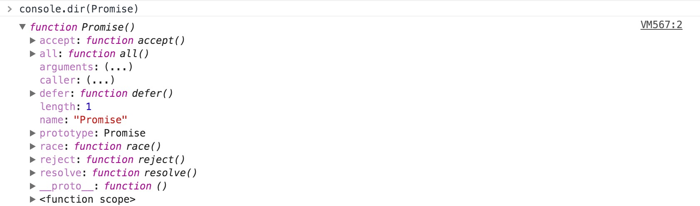

### `Promise`

`resolve`函数的作用是在异步操作成功时候调用，并且将异步操作的结果作为参数传递出去。

```js
function runAsync(){
  var p = new Promise(function (resolve, reject) {
    setTimeout(function () {
      console.log('excute finished');
      resolve('hello world');
    },2000)
  });
  return p;
}
//在runAsync中传给resolve的数据，能在接下来的then方法中拿到
runAsync().then(function (data) {
  console.log(data);
  return runAsync();//不可少
}).then(function (data) {
  console.log("welcome"+" "+data);//welcome hello world
});
```
>`catch`

```js
//console.dir(Promise.prototype)=>catch,chain,then,constructor
function getNumber(){
  var p = new Promise(function (resolve, reject) {
    setTimeout(function () {
      var num = Math.random()*10;
      if(num < 5){
        resolve(num);
      }else{
        reject('number too large');
      }
    },2000)
  });
  return p;
}
//then方法可以接受两个参数，第一个对应resolve的回调，第二个对应reject的回调。
getNumber().then(function (data) {
  console.log('resolved');
  console.log(data);
  console.log(somedata);
}).catch(function (reason) {
  console.log('rejected');
  console.log(reason);
});
//catch在执行resolve回调时，如果代码异常，不会报错，而是进到catch方法中。
```

打开控制台，输入：
```js
console.dir(Promise.prototype)
```
可以看到：catch,chain,then方法在Promise原型里。


>`Promise.resolve()`

`Promise.resolve()`将现有对象转为Promise对象。

>`Promise.reject()`返回一个新的`Promise`实例，实例状态为`rejected`

<br>

>`Promise.done()`

`done()`方法处于回调链的尾端


