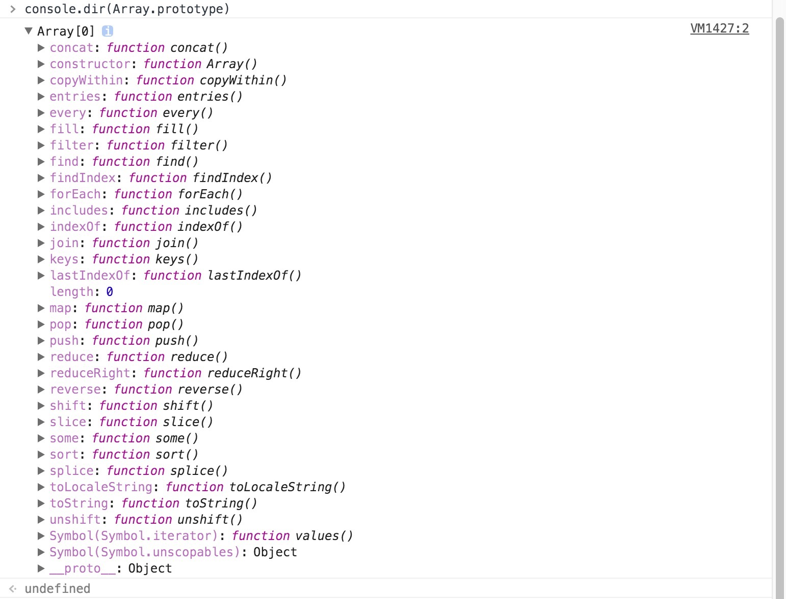

### 逻辑与和逻辑或
&& (逻辑与) 和||（逻辑或）混合使用的时候要注意他们的优先级：
&& (逻辑与) 优先级高于||（逻辑或）

`return a && b || c `,
根据a来判断返回值，a 是 false 则肯定返回 c；如果 b , c 都是 true ，那么我们就可以根据 a 来决定b 还是 c ，如果 a 是 false 则返回 c，如果a是true 则返回 b。

```
 var a = 3  &&  0 || 2;  //2 , false || true
var b = 3 || 0  &&  2; // 3 , true || false
var c= 0 || 2 && 3; // 3 ,false || true
```
&&遇到false返回，||遇到true返回：

`Array.isArray()` IE9以下不支持

### 数组



- [ES6 数组实例](./App.js)
